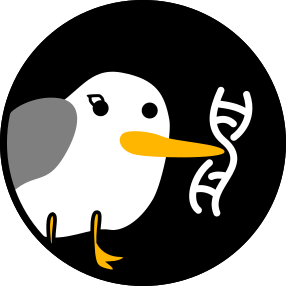

<div align="center">
    
	<h1><code>SigAlign</code></h1>
	<p>
		A <b>Si</b>milarity-<b>G</b>uided <b>Align</b>ment Algorithm
	</p>
    <p>
        <a href="https://github.com/baku4/sigalign/actions/workflows/build_and_test.yml/" target="_blank"></a>
        <a href="https://github.com/baku4/sigalign/" target="_blank"></a>
        <br>
		<a href="https://crates.io/crates/sigalign/" target="_blank"></a>
        
        
		<a href="https://pypi.org/project/sigalign/" target="_blank"></a>
	</p>
</div>

## What is `SigAlign`?
SigAlign is a library for **biological sequence alignment**, the process of matching two sequences to identify similarity, which is a crucial step in analyzing sequence data in bioinformatics and computational biology. If you are new to sequence alignment, a quick overview on [Wikipedia](https://en.wikipedia.org/wiki/Sequence_alignment) will be helpful.

SigAlign is a **non-heuristic** algorithm that outputs alignments satisfying two cutoffs:

1. **Minimum Length**
2. **Maximum Penalty per Length**

In SigAlign, the penalty is calculated based on a **gap-affine scheme**, which imposes different penalties on mismatches, gap openings, and gap extensions.

### Core Purpose

SigAlign is designed to be:

- ⚡️ **Fast** to collect highly similar alignments
- 💡 **Easy** to customize and explain results
- 🧱 **Small and flexible** to be a basic building block for other tools

SigAlign is **not** intended to:

- Align ultra-long reads
- Search for low similarity alignments

## Quick Start Examples

### For `Rust` developer

- As a Rust library, SigAlign can take advantage of the most abundant features in Rust.
  - Registered on `crates.io`: https://crates.io/crates/sigalign/
  - API documentation: https://docs.rs/sigalign/

```rust
use sigalign::{
    Aligner,
    algorithms::Local,
    ReferenceBuilder,
};

// (1) Build `Reference`
let fasta =
br#">target_1
ACACAGATCGCAAACTCACAATTGTATTTCTTTGCCACCTGGGCATATACTTTTTGCGCCCCCTCATTTA
>target_2
TCTGGGGCCATTGTATTTCTTTGCCAGCTGGGGCATATACTTTTTCCGCCCCCTCATTTACGCTCATCAC"#;
let reference = ReferenceBuilder::new()
    .set_uppercase(true) // Ignore case
    .ignore_base(b'N') // 'N' is never matched
    .add_fasta(&fasta[..]).unwrap() // Add sequences from FASTA
    .add_target(
        "target_3",
        b"AAAAAAAAAAA",
    ) // Add sequence manually
    .build().unwrap();

// (2) Initialize `Aligner`
let algorithm = Local::new(
    4,   // Mismatch penalty
    6,   // Gap-open penalty
    2,   // Gap-extend penalty
    50,  // Minimum length
    0.2, // Maximum penalty per length
).unwrap();
let mut aligner = Aligner::new(algorithm);

// (3) Align query to reference
let query = b"CAAACTCACAATTGTATTTCTTTGCCAGCTGGGCATATACTTTTTCCGCCCCCTCATTTAACTTCTTGGA";
let result = aligner.align(query, &reference);
println!("{:#?}", result);
```

### For `Python` developer

- SigAlign's Python binding is available on PyPI: https://pypi.org/project/sigalign/
  - Use `pip` to install the package: `pip install sigalign`

```python
from sigalign import Reference, Aligner

# (1) Construct `Reference`
reference = Reference.from_fasta_file("./YOUR_REFERENCE.fa")

# (2) Initialize `Aligner`
aligner = Aligner(4, 6, 2, 50, 0.2)

# (3) Execute Alignment
query = "CAAACTCACAATTGTATTTCTTTGCCAGCTGGGCATATACTTTTTCCGCCCCCTCATTTAACTTCTTGGA"
results = aligner.align_query(reference, query)

# (4) Display Results
for target_result in results:
    print(f"# Target index: {target_result.index}")
    for idx, alignment in enumerate(target_result.alignments):
        print(f"  - Result: {idx+1}")
        print(f"    - Penalty: {alignment.penalty}")
        print(f"    - Length: {alignment.length}")
        print(f"    - Query position: {alignment.query_position}")
        print(f"    - Target position: {alignment.target_position}")
```

### For `Web` developer

- SigAlign offers a WebAssembly (WASM) build, opening up the potential for web-based applications. While it is not currently available through package managers such as `npm`, plans for web support are in the pipeline.
- An exemplary WASM implementation can be found within the `example` directory. Below is a TypeScript example showcasing SigAlign's application via this WASM wrapper:

```ts
import init, { Reference, Aligner, type AlignmentResult } from '../wasm/sigalign_demo_wasm';

async function run() {
    await init();

    // (1) Construct `Reference`
    const fasta: string = `>target_1
ACACAGATCGCAAACTCACAATTGTATTTCTTTGCCACCTGGGCATATACTTTTTGCGCCCCCTCATTTA
>target_2
TCTGGGGCCATTGTATTTCTTTGCCAGCTGGGGCATATACTTTTTCCGCCCCCTCATTTACGCTCATCAC`;
    
    const reference: Reference = await Reference.build(fasta);
    
    // (2) Initialize `Aligner`
    const aligner: Aligner = new Aligner(
        4,    // Mismatch penalty
        6,    // Gap-open penalty
        2,    // Gap-extend penalty
        50,   // Minimum aligned length
        0.2,  // Maximum penalty per length
    );

    // (3) Execute Alignment
    const query: string = "CAAACTCACAATTGTATTTCTTTGCCAGCTGGGCATATACTTTTTCCGCCCCCTCATTTAACTTCTTGGA";
    const result: AlignmentResult = await aligner.alignment(query, reference);

    // (4) Parse and Display Results
    const parsedJsonObj = JSON.parse(result.to_json());
    console.log(parsedJsonObj);
}

run();
```

- To gain further insight into web-based implementation of SigAlign, visit the SigAlign [tour page](https://baku4.github.io/sigalign/). This page utilizes the WASM wrapper exemplified above.

## License

SigAlign is released under the [MIT License]((https://github.com/baku4/sigalign/blob/main/LICENSE)).

## Citation

Bahk, K., & Sung, J. (2024). SigAlign: an alignment algorithm guided by explicit similarity criteria. *Nucleic Acids Research*, gkae607. https://doi.org/10.1093/nar/gkae607
